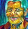

# behance_release

This is the PyTorch code for [''Learning from Multi-domain Artistic Images for Arbitrary Style Transfer''](https://arxiv.org/abs/1805.09987) in Expressive 2019.  


The pre-trained model on the behance-face dataset can be found [here](https://drive.google.com/file/d/1fEKb9yIbXQb07jIJanPbAaO4LkcV4Xbp/view?usp=sharing). 

To test the pre-trained model, put the downloaded models in folder named ''models'', put content images in ''data/content/test'', style images in ''data/style/test'' and run 
```
python test_autoencoder.py  --content-data  data/content --style-data data/style --enc-model models/vgg_normalised_conv5_1.t7 --dec-model none  --dropout 0.5 --gpuid 0 --train-dec --dec-last tanh --trans-flag adin  --diag-flag batch --ae-mix mask --ae-dep E5-E4 --base-mode c4 --st-layer 4w --test-dp --save-image output/face_mask --dise-model  models/behance_release.pth
```

The stylized images can be found in folder ''output''. Here are some test cases  used in the paper:

(content/style/output)

  

  

  

  

  

  

  


To train a model, please run
```
python train_mask.py  --dataset face --content-data  data/behance_images/faces_align_content_gender --style-data  data/behance_images/faces_behance_lfw_celebA_dtd --enc-model models/vgg_normalised_conv5_1.t7 --dec-model none  --epochs 150 --lr-freq 60 --batch-size 56 --test-batch-size 24 --num-workers 8  --print-freq 200 --dropout 0.5 --g-optm adam  --lr 0.0002 --optm padam --d-lr 0.00002 --adam-b1 0.5  --weight-decay 0 --ae-mix mask --dise-model none --cla-w 1 --gan-w 1 --per-w 1 --gram-w 200 --cycle-w 0 --save-run debug_gan --gpuid 0,1,2,3 --train-dec --use-proj --dec-last tanh --trans-flag adin --ae-dep E5-E4 --base-mode c4  --st-layer 4w --seed 2017
```

## citation 
```
@article{xu2018beyond,
  title={Beyond textures: Learning from multi-domain artistic images for arbitrary style transfer},
  author={Xu, Zheng and Wilber, Michael and Fang, Chen and Hertzmann, Aaron and Jin, Hailin},
  journal={arXiv preprint arXiv:1805.09987},
  year={2018}
}
```

### acknowledgement
We thank the released PyTorch code and model of [WCT style transfer](https://github.com/sunshineatnoon/PytorchWCT). 

